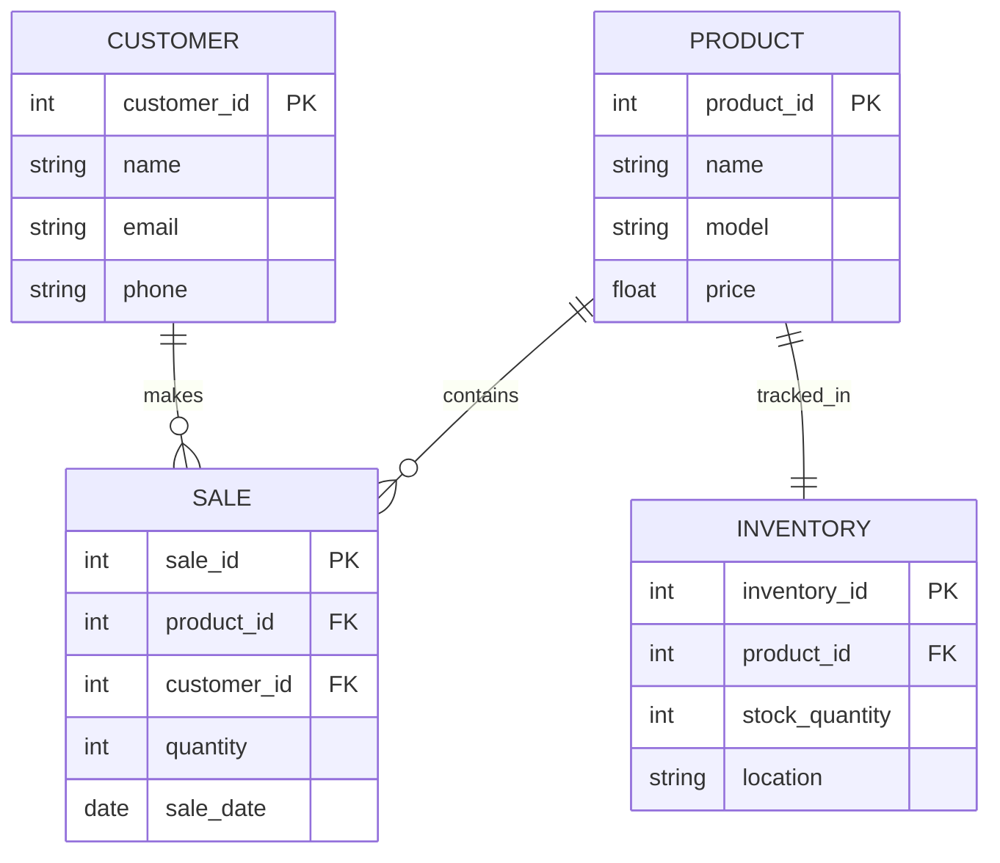

# Nike Store Entity Relationship Diagram (ERD)

This ERD models the data relationships in a Nike retail shoe store.

## Entity Descriptions

- **PRODUCT**: Stores details of each Nike shoe such as model name and price.
- **CUSTOMER**: Contains customer information for communication and purchase history.
- **SALE**: Records transactions showing which customer bought which product, in what quantity, and when.
- **INVENTORY**: Keeps stock records of each product, including location and quantity.

## Relationship Explanations

- A **PRODUCT** can be sold in many **SALE** transactions (1-to-many).
- A **CUSTOMER** can make many **SALE** transactions (1-to-many).
- Each **PRODUCT** has a single **INVENTORY** record showing current stock (1-to-1).

This ERD ensures that sales are tied to actual customers and available inventory, helping the store track performance and manage stock efficiently.

